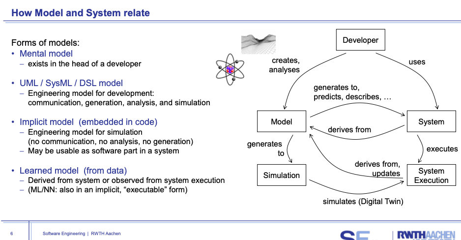
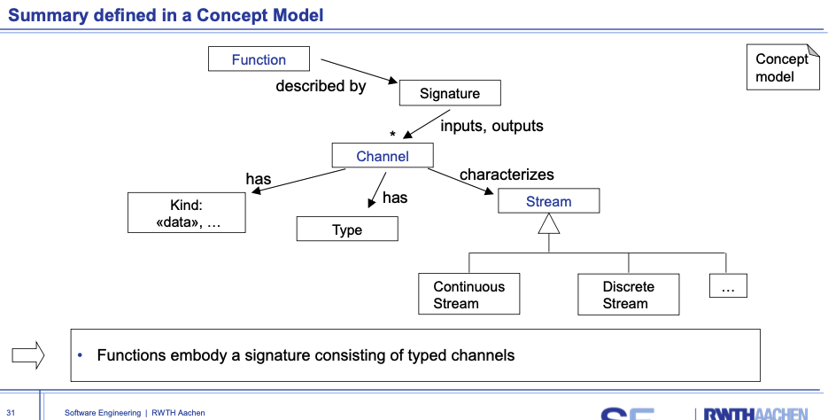

# 00 - Lecture Intro

- The Limits of my Language Mean the Limits of my World (Wittgenstein)  

# 01 - Model

## Theory

A formal **theory** is syntactic in nature.  
 Thus a theory comes with an underlying **language**  
Modelling languages enable to make models explicit and manageable
- rule defined, e.g. 人不能吃电风扇。
 A theory is an **analytical tool** for understanding, explaining, and making predictions about a given subject matter.

Pyramid

theory

• Mapping feature
 A model is based on an original
• Reduction feature
 A model only reflects a (relevant) selection of the original‘s properties
• Pragmatic feature
 A model needs to (be) usable in place of the original with respect to some purpose

# 02 - Datastructure CD
cyber-physical systems
model based on real world

Class Diagram
Associations
- qualified association(ordered)

Composition

# 03 - Software CD
code generation from cd using monti core

# 04 - Systems Engineering
A system is a set of entities, real or abstract, comprising a whole
Systems Engineering (SysE) is an interdisciplinary approach and means to enable the realization of successful systems.

in the past software was in singele machine.
now human is kind of part of the system.

# 05 - Function Paradigm
非确定性 (Nondeterminism) 和欠规范性 (underspecification)系统存在一个可能的行为集合

# 06 - Statecharts
# 06B - Statecharts 2
# 07 - Architecture
# 08 - Logic OCL
# 09 - Behaviour OCL
# 10 - OD
# 11 - Sequence Diagrams
# 12 - Methods
# 13 - Tests
# 14 - Evolution
# 15 - Digital Twin
# 16 - Advanced Methods
