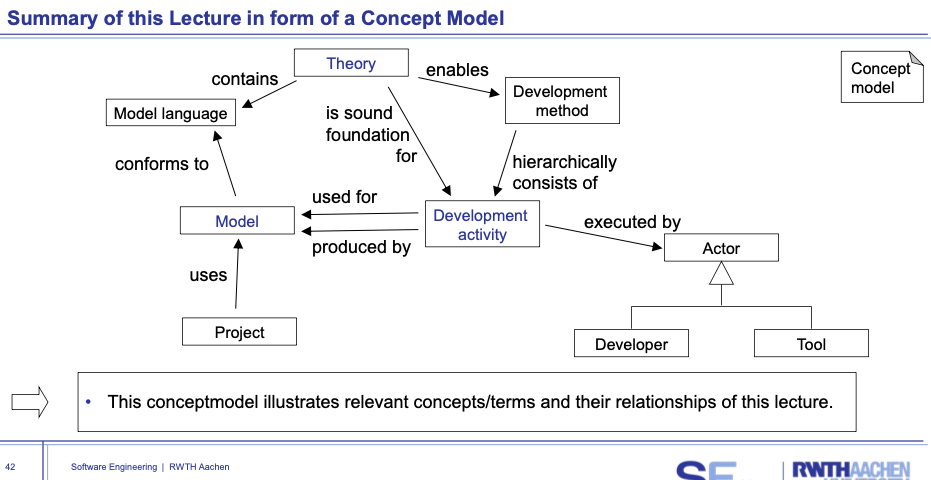
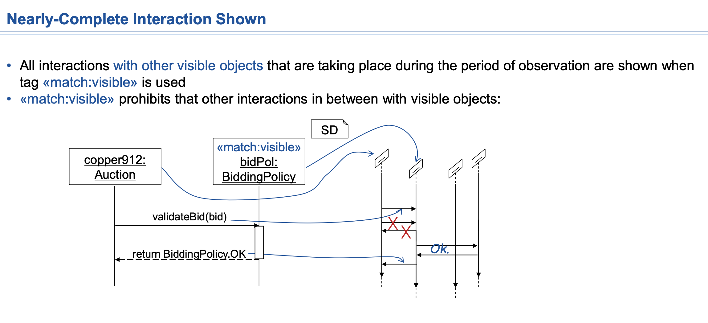
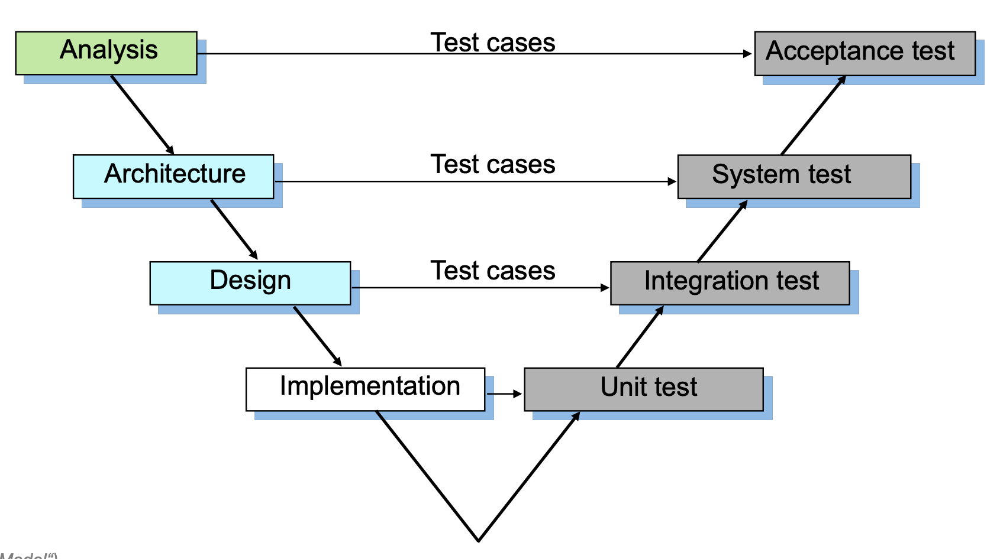

和之前的 document-based engineering 不同，model-based engineering 是基于模型的工程。  
每个人对 document 的理解都不一样，可能会有歧义。  
我们通过进一步的抽象来消除歧义。
model-based aligns the understanding of the system and its components.

# 00 - Lecture Intro

- The Limits of my Language Mean the Limits of my World (Wittgenstein)  

# 01 - Model

## Theory

A formal **theory** is syntactic in nature.    
 Thus a theory comes with an underlying **language**  
Modelling languages enable to make models explicit and manageable
- rule defined, e.g. 人不能吃电风扇。
 A theory is an **analytical tool** for understanding, explaining, and making predictions about a given subject matter.

Pyramid

theory

• Mapping feature
 A model is based on an original
• Reduction feature
 A model only reflects a (relevant) selection of the original‘s properties
• Pragmatic feature
 A model needs to (be) usable in place of the original with respect to some purpose

# 02 - Datastructure CD
cyber-physical systems
model based on real world

Class Diagram
Associations
- qualified association(ordered)

Composition

# 03 - Software CD
code generation from cd using monti core

# 04 - Systems Engineering
A system is a set of entities, real or abstract, comprising a whole
Systems Engineering (SysE) is an interdisciplinary approach and means to enable the realization of successful systems.

in the past software was in singele machine.
now human is kind of part of the system.

# 05 - Function Paradigm
非确定性 (Nondeterminism) 和欠规范性 (underspecification)系统存在一个可能的行为集合

# 06 - Statecharts
transition vs actions

UML Interpretation of Statecharts in Software
• State of the automaton = set of states of the object
• Initial state = set of object states that occur
immediately after construction (new ...)
• Final state does not matter, because garbage
collection in Java “terminates” objects
• Input characters = method call including arguments
• Output character = result of a method execution
 Includes attribute changes, other method calls
• Transition = execution of a method body
• Distinction between state diagram and object state!

SysML Interpretation of Statecharts in Cyber-Physical Systems
• State of the automaton =
equivalence class of states of the component
• Initial state = component states that occur at start
• Final state normally not applicable to physical systems
• Input = incoming discrete things and signals in a
machine
• Output = modified things as well as computed answers
• Transition = operation of the CPS transforming the input
to an adequate output using and adapting internal states
• Statecharts cover all domains. Even though in the
following the examples usually belong only to one
domain.Let’s keep this in mind!
# 06B - Statecharts 2

# 07 - Architecture

Simulation approximate imitation of the operation of a process 
- Ticks

# 08 - Logic OCL

# 09 - Behaviour OCL

# 10 - OD

# 11 - Sequence Diagrams

不理解，什么是visible object。图片上哪里禁止了。

# 12 - Methods

# 13 - Tests
# 14 - Evolution
# 15 - Digital Twin
# 16 - Advanced Methods

