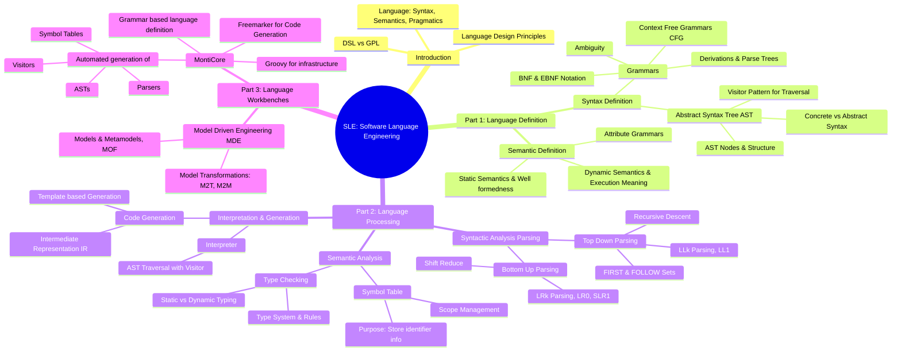

Mill

parsing：
- Scanner then Parser
- Parse tree

AST
- contrains only essential information, semantics context

coco
visitor，Traverser
traverser.add(visitor)
ast.accept(traverser)

Genitor
symbol, template, resolve, trafo
- Artifact Scope
- global scope
- buttomUp resolve

Software Language Engineering

# 1. Introduction 
1.2. Example Language Applications 
1.3. CD4Analysis Language 
1.4. What is a Language?
     Syntax ("representation")
     Semantics (“meaning”)
     Pragmatics (“forms of use”)
1.5. Structure of a Language Processing Tool
model -> AST (CoCo, Visitor, Symbol) -> Code Generation (templates)

controlscript
workflow execution
function library
input/output AST 有什么区别
model after和 before 

grammar:
- production:  nonterminal = definition(body)

# 2. Parsing with Grammars，generated from .mc4 files
model -Scanner-> token with token class -Parser-> AST

Tree with expression nodes

This section discusses the use of grammars in parsing processes, focusing on their application in software language engineering.
2.1. Compiler Construction – An Overview
Provides an overview of compiler architecture, detailing the main tasks such as 
    reading and
    verifying source code, and generating target language code.

2.2. Scanner
Explores the role of scanners in compilers, explaining how they break down source code into tokens and filter out unnecessary elements like whitespace and comments.

2.3. Parser
Describes the function of parsers in checking the correctness of source code against specified grammars, generating understandable error messages, and producing Abstract Syntax Trees (ASTs).

2.4. MontiCore’s Grammar Language
Details MontiCore’s specific grammar language, highlighting how it facilitates parser generation by defining tokens, nonterminals, and their grammatical rules.

# 3. Designing a Modeling Language, 
• This section discusses the foundational steps in designing a modeling language, with a focus on domain-specific languages (DSLs).
3.1. Language Design on an Example
• Illustrates the process of designing a language using the example of modeling finite automata, starting from clarifying needs to defining syntax and deriving parsers.

AST is a (containment) tree
- nonterminals are nodes / objects
- terminals are leaves / attributes  

AST doesn't miss information, like addition, but makes it as an expression node.

# 4. AST，Abstract Syntax Tree， CFG
AST classes can be automatically derived from a grammar.  
AST Objects structure is from text file.

TOP (Template Override Pattern)  
which are crucial data structures in software language engineering, utilized for representing the structure of parsed code.
4.1. Literals
Explores how literals are implemented in grammars, detailing specific tokens and fragments used to define simple data types and their conversion from strings to values.  

4.2. Productions/ components
Describes how productions in a grammar are converted into structured components within an AST, emphasizing the handling of various grammatical constructs like terminals, nonterminals, and optional elements.
4.3. Extending the AST
Focuses on methods to extend the AST by adding new attributes or methods without changing the grammar's concrete syntax, using MontiCore-specific directives like astrule, astextends, and astimplements.
4.4. Runtime Environment and Generated AST Classes
Details the runtime environment and the automatic generation of AST classes from grammars, explaining the roles of these components in processing and executing the language structures defined in the grammar.
4.5. ANTLR as Parser Generator
Discusses the use of ANTLR as a tool for generating parsers based on grammar specifications, outlining how it integrates within MontiCore to produce parsers that convert code into ASTs.

## 5. Languages: Examples, Quality, Library
5.1. Language Examples
Provides examples of languages and language components developed using MontiCore, highlighting the structure and utility of various language models and how they contribute to effective software development.

5.2. Language Quality
Explores what constitutes a high-quality language, detailing the criteria and metrics used to assess language designs and their implementations in tools and systems.

5.3. The Library Concept
Explains the concept of a language component library in MontiCore, which facilitates the reuse of language components across different projects, enhancing modularity and efficiency in language development.

5.4. Core Language Component Library
Details the core components available in the MontiCore language library, describing how these fundamental elements are used to build more complex language structures and applications.

5.5. Language Component Library: Layer 2
Explores the second layer of the MontiCore language component library, which focuses on specialized languages that extend the base components with more specific functionality tailored to particular applications or domains.

# 6. CoCos，Well-formedness Rules – Context Conditions, Visitors Traversal, 
6.1. Context Conditions(CoCo), well-formed
    Context Condition (CoCo) is a predicate on a CFG-correct sentence where the context is used to determine its (full) correctness.
6.2. Error Reporting / violations
6.3. CoCo Implementation
6.4. Visitor Design Pattern for AST Traversal
6.5. Generating Visitors
    • Traverser: 
        ○ XXXXTraverser.class gen
        ○ Interacts with the AST
        (default traversal and handling via depth-first algorithm)
    • Visitor: 
        ○ Hook point
        ○ XxxxxxVisitor2.class gen 
        ○ Performs computations on AST when entering/leaving a node
    • Handler (optional): 
        ○ Hook point
        ○ xxxxHandler.class gen
        ○ Custom AST traversal and handling 
    
    MC generates a handler interface for each language
     (e.g., AutomataHandler for Automata language)
    
    XXX.mc4
    xxxHandler
    

# 7. Symbol Management
7.1. Symbols
7.2. Symbol Visibility and Scopes
7.3. Defining Symbols with MontiCore
7.4. Generated Parts
7.5. Building the Symbol Table
7.6. Symbol Resolution
7.7. Load and Store Symbol Tables
7.8. On the Dual Role of Libraries
7.9. Round Up
7.A1. Symbols in Automata

# 8. Generators
8.1. Forms of Generators
8.2. Template-Engine FreeMarker
8.3. MontiCore’s Freemarker API
8.4. Some Templates Explained

# 9. Advanced Generator Principles
9.1. Integration of Handwritten Code
9.2. Hook Points in Templates – Improving reuse
9.3. Mixing Transformations and Hook Points

# 10. Language Composition
10.1. Model Composition
10.2. Forms of Language Operators
10.3. Language Composition Operators
10.4. Conservative Extension
10.5. Example: UML as Composed Language
10.6. Generated Compositional Infrastructure

# 11. Language Composition in Depth
11.1. Symbols and Scopes allow Composition in Depth
11.2. Symbols used across Languages (and Models)
11.3. Symbols in the MC Library
11.4. Example MontiArc
11.5. Technical Realization of Symbols used across Languages

# 12. Technical Realization
12a. Technical Foundations
12b. Methodical Considerations
12b.1. The Role of DSLs in Software Engineering
12b.2. Best Practices for MontiCore DSL Development
12b.3. Coupling Tool and Product Development
12b.4. Managing Language Evolutionsymbolrule
12b.5. Architectural Considerations for Language Workbenches
12c. Advanced Topics
12c.1. Meta-Modeling
12c.2. Language Interoperability
12c.3. Language Customization
12c.4. Language Profiles
